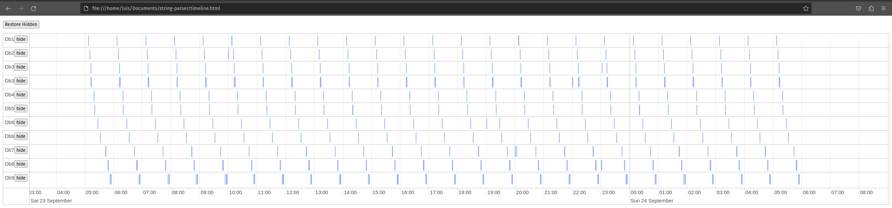

# Metabase timeline task viewer

A simple log parser that will render the sync, scan, fingerprint and get field values in a timeline so you can visually see when things are happening

## How to run

1) Install Node.js
2) prepare your log files (locate them on disk)
3) run `node parse.js /path/to/log`
4) open the generated html file on any web browser

## Example

## To do
- make it more automagical
- make the fs async, was done this way to finish it quickly